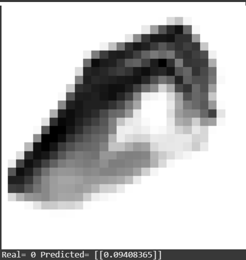
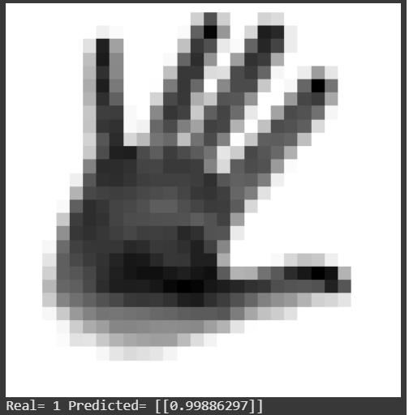
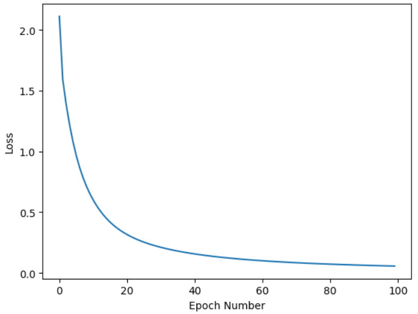
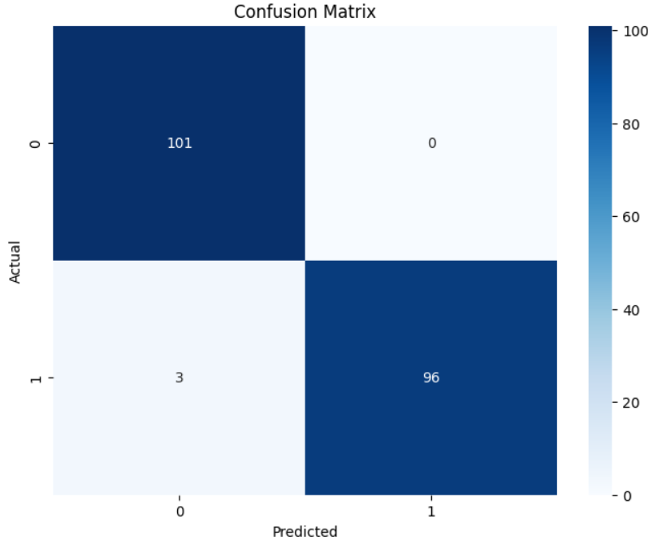

**Author**: Guy Houri, Yoav Gal  
**Date**: Submitted as mid-semester project report for Basic Of Deep Learning course, Colman, 2024  
**Title**: Basic Of Deep Learning - Mid Semester Project Part 1  

**Important Notice**: This is a summary of the main paper. Please consult the paper for all explanations and accuracy. See the [presentation](presentation.pdf).

# Introduction

## Introduction
This project performs **binary image classification** on sign language digits: class **0** vs. class **5**. It uses a feedforward neural network with **one hidden layer** (128 neurons) and **sigmoid** activation, trained via **backpropagation** with **binary cross-entropy loss**.

<figure style="display:flex; gap:20px;">
  <div>
    
    <figcaption>Predicted Sign: 0</figcaption>
  </div>
  <div>
    
    <figcaption>Predicted Sign: 5</figcaption>
  </div>
</figure>

---
## Data

Language Digits dataset with 5,000 grayscale images (28×28 pixels each), representing digits 0–9. Stored as a NumPy array (5,000 rows × 784 columns).

## Problem

Recognizing hand signs (digits) in images is challenging due to variations in hand size, orientation, lighting, and individual differences.

# Solution

## General approach

A supervised approach using a feedforward neural network with one hidden layer. The network takes raw pixel data, learns features via the hidden layer, and outputs probabilities for classes 0 or 5.

## Design

### Environment

Implemented in a Jupyter Notebook on Google Colab. Python libraries (NumPy, scikit-learn) were used for numerical and machine learning tasks. Colab’s cloud resources enabled efficient model training.

### Architecture

**Pre Processing**

Filter, Normalize, and Split to train and test.
```py
    # filter
    mask = (y == "0") | (y == "5")
    X_filtered = X[mask]
    Y_filtered = y[mask]

    # Normalize
    X = X_filtered/255.0 # to become value from 0-1 insted of 0-255

    # Split
    indices = np.random.permutation(X.shape[1])
    split_point = int(0.8 * X.shape[1])
    X_train, X_test = X[:, indices[:split_point]], X[:, indices[split_point:]]
    Y_train, Y_test= Y[:, indices[:split_point]], Y[:, indices[split_point:]]
```

**Activation Function**  
We use the sigmoid function for non-linear transformations:  
```py
def sigmoid(x):
    return 1 / (1 + np.exp(-x))
```

**Loss Function**  
Binary cross-entropy measures how different predictions are from actual labels. We clip predictions to avoid `log(0)` errors:  
```py
def log_loss(y_hat, y):
    closeToZero = 1e-15
    y_hat = np.clip(y_hat, closeToZero, 1 - closeToZero)
    return -(y * np.log(y_hat) + (1 - y) * np.log(1 - y_hat))
```

**Hyperparameters**  
- **Input Layer**: 784 features (28×28)  
- **Hidden Layer**: 128 neurons (trade-off between capacity & overfitting)  
- **Learning Rate**: 0.01  
- **Epochs**: 100  
- **Batch Size**: 32  

**Forward Propagation**  
```py
Z1 = np.matmul(W1, X_batch) + b1
A1 = sigmoid(Z1)
Z2 = np.matmul(W2, A1) + b2
A2 = sigmoid(Z2)
```

**Back Propagation**  
Backpropagation calculates the gradient of the loss function \(L\) with respect to each weight:

$$
\nabla L(\theta) = \frac{\partial L(\theta)}{\partial \theta}, 
\quad \theta \leftarrow \theta - \eta \,\nabla L(\theta)
$$

where $\eta$ is the learning rate.

### Derivative Calculation (Chain Rule)

$$
dZ_2 = \frac{dL}{dZ_2} = \frac{dL}{dA_2} \cdot \frac{dA_2}{dZ_2}.
$$

From the binary cross-entropy derivation:

$$
\frac{dL}{dA_2} = \frac{A_2 - y}{A_2(1-A_2)}, 
\quad
\frac{dA_2}{dZ_2} = A_2(1 - A_2).
$$

Thus,

$$
\frac{dL}{dZ_2} = A_2 - y.
$$

### Weight Gradients

$$
Z_2 = W_2 A_1 + b_2 
\quad\Longrightarrow\quad 
\frac{\partial L}{\partial W_2} = (A_2 - y)A_1^\top
$$

and similarly for \(b_2\).


Below is the backprop code combining all steps:

```py
# dZ2 = derivative of loss wrt Z2
dZ2 = (A2 - Y_batch.reshape(1, -1))

# Gradients for W2, b2
dW2 = np.matmul(dZ2, A1.T) / batch_size
db2 = np.sum(dZ2, axis=1, keepdims=True) / batch_size

# Backprop to hidden layer
dA1 = np.matmul(W2.T, dZ2)
dZ1 = dA1 * sigmoid_derivative(Z1)

# Gradients for W1, b1
dW1 = np.matmul(dZ1, X_batch.T) / batch_size
db1 = np.sum(dZ1, axis=1, keepdims=True) / batch_size

# Weight updates
W2 -= learning_rate * dW2
b2 -= learning_rate * db2
W1 -= learning_rate * dW1
b1 -= learning_rate * db1
```

## Base Model (Summary)
- **Input**: A 28×28 grayscale image (values 0–255), normalized to 0–1.  
- **Output**: A probability between 0 and 1 indicating if the image is sign “0” (near 0) or sign “5” (near 1).  

<figure style="display:flex; gap:20px;">
  <div>
    
    <figcaption>Predicted Sign 0</figcaption>
  </div>
  <div>
    
    <figcaption>Predicted Sign 5</figcaption>
  </div>
</figure>

---

### Results and Metrics

1. **Loss**  
   - **Binary Cross-Entropy** was tracked over epochs (Figure 1).  
   - It steadily decreased, showing effective learning.  
   - Validation loss followed a similar trend (no major overfitting).

   

2. **Confusion Matrix**  
   - Shows **TP**, **TN**, **FP**, **FN**.  
   - High accuracy with minimal misclassifications (Figure 2).

   

3. **Classification Report**  
   
  
    $$
    
    \text{Accuracy} = \frac{\mathrm{TP + TN}}{\mathrm{TP + TN + FP + FN}}
    $$

    $$
    \text{Precision} = \frac{\mathrm{TP}}{\mathrm{TP + FP}}
    $$

    $$
    \text{Recall(Sensitivity)} = \frac{\mathrm{TP}}{\mathrm{TP + FN}}
    $$

    $$
    F1 = 2 \times \frac{\text{Precision} \times \text{Recall}}{\text{Precision} + \text{Recall}}
    $$

  

    **Support**: number of samples per class.  

    **Macro Avg**: unweighted average across classes.  

    **Weighted Avg**: average weighted by support.


|                | precision | recall | f1-score | support |
|----------------|-----------|--------|----------|---------|
| **0 digit sign** | 0.97      | 1.00   | 0.99     | 101     |
| **5 digit sign** | 1.00      | 0.97   | 0.98     | 99      |
| **accuracy**   |           |        | 0.98     | 200     |
| **macro avg**  | 0.99      | 0.98   | 0.98     | 200     |
| **weighted avg**| 0.99      | 0.98   | 0.98     | 200     |

The model demonstrates **high accuracy (0.98)** for sign language digit classification. Both precision and recall **exceed 0.97** for the classes (0, 5), indicating **strong performance** in recognizing and distinguishing the two hand gestures.

# Discussion

Our project confirms that a simple feedforward neural network can accurately classify sign language digits (0 and 5) with a **98%** accuracy rate. The strong precision and recall for both classes highlight the network’s effectiveness.  

- **Key Findings**:  
  - A single hidden-layer architecture can achieve high performance, showcasing the potential of deep learning in sign language recognition.

- **Limitations & Considerations**:  
  1. **Dataset Expansion**: Incorporate all digits (0–9) for broader real-world applicability.  
  2. **Hyperparameter Tuning**: Optimize learning rate, hidden-layer size, etc., for even better accuracy.  
  3. **Advanced Architectures**: Experiment with CNNs (and other models) to leverage spatial feature extraction.

- **Conclusion**:  
  This work underscores the promise of deep learning for sign language digit recognition. Addressing current limitations and exploring advanced methods can further enhance performance and applicability in related tasks.


## links

[colab notebook](https://colab.research.google.com/drive/17l2Hzcw9iYNcaJ6eD4uKhlNWUl5fsWA1?usp=sharing)

[link to the full article](./presentation.pdf)

Good luck!!
